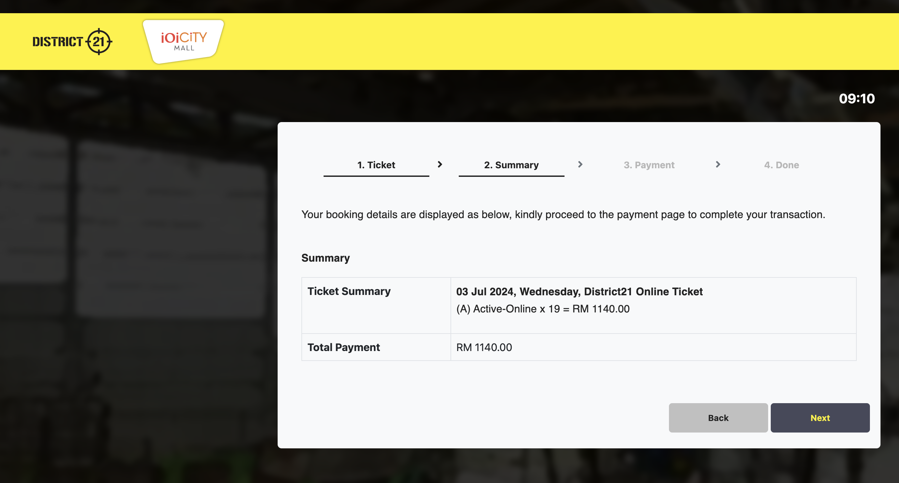
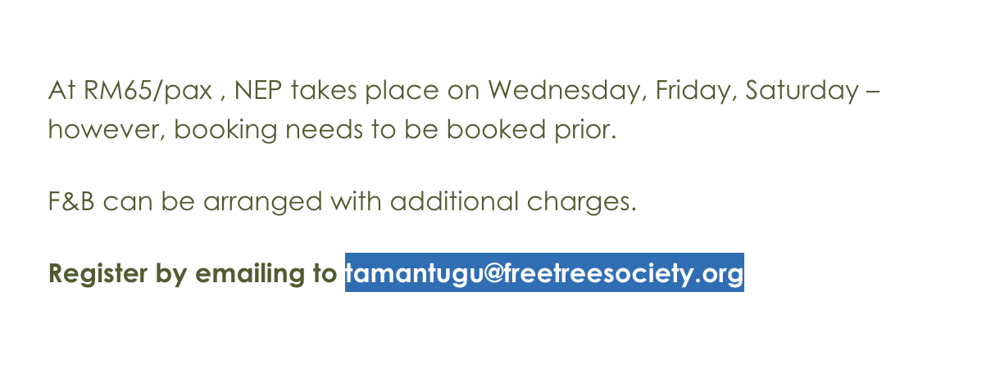
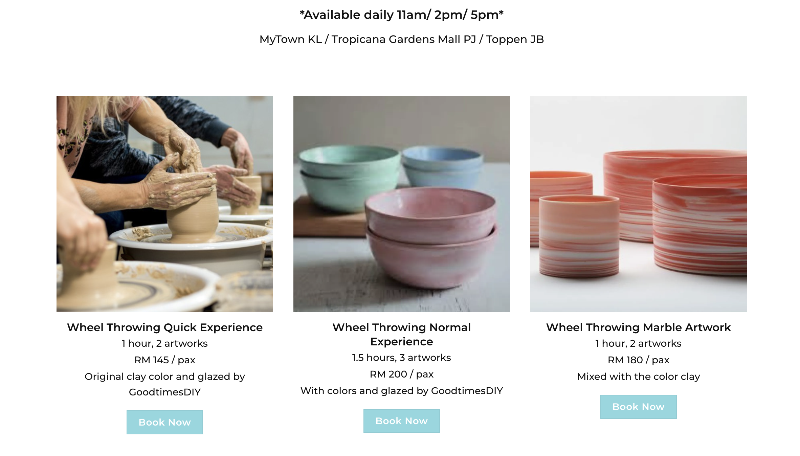
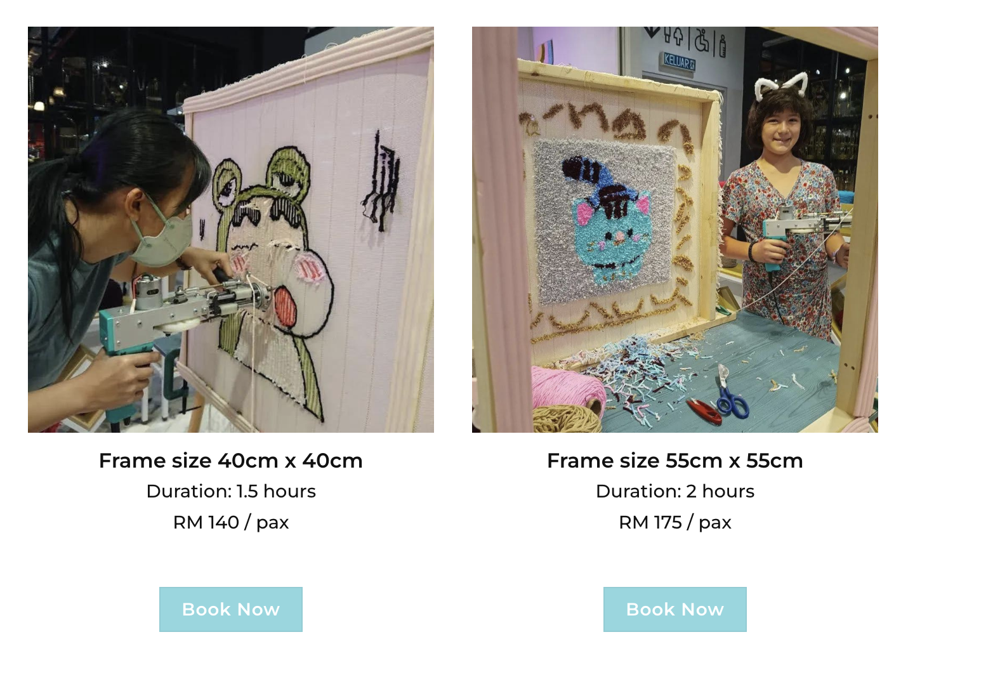

## Indoor Like Outdoor Activities

1. District 21 | [Tickets](https://d21.ioileisure.com.my/) | RM60/pax

 

2. ESCAPE @ Paradigm Mall | [Tickets](https://escape-pj.thecoolmelon.com/) | RM91.48/pax

 

## Outdoor Activities

1. Painball
2. [Taman Tugu Nature Education Program](https://tamantugu.my/things-to-do/nature-education-programme/) | RM65/PAX

 
 
3. Driving Range Golf | RM14-19/PAX not inclusive of clubs
4. Hiking?
5. Picnic @ Saujana or Taman Botani | Potluck/Lunch
6. Horse Riding?
7. Boat/[Cruise Tasik Putrajaya](https://www.cruisetasikputrajaya.com/about-ctp.html) | RM27-30/PAX 45min-2Hours

## Indoor Activities

1. [GameHub](https://says.com/my/lifestyle/new-indoor-game-hub-opens-in-1u-with-mini-golf-ping-pong-more) @ 1UTAMA | [Tickets](https://superpark.com.my/tickets/) | RM29/PAX

    1. Mini Golf
    2. Games and stuff
    3. giant pool/snooker

     

2. Bowling
3. Escape Room (TBD)

## Workshops

Good Times workshop can offer RM5 discount per pax. Price shown below is original.

1.  Good Times [Pottery](https://www.goodtimesdiy.my/pottery-studio/pottery-class/) | RM145/PAX
    
2.  Good Times [Tufting](https://www.goodtimesdiy.my/tufting-studio/tufting-class/) | RM140/PAX

    

3.  Good Times [Baking](https://www.goodtimesdiy.my/bake-studio-menu/) | RM95-150/PAX
    

4.  Terrarium | Out of reach for now
